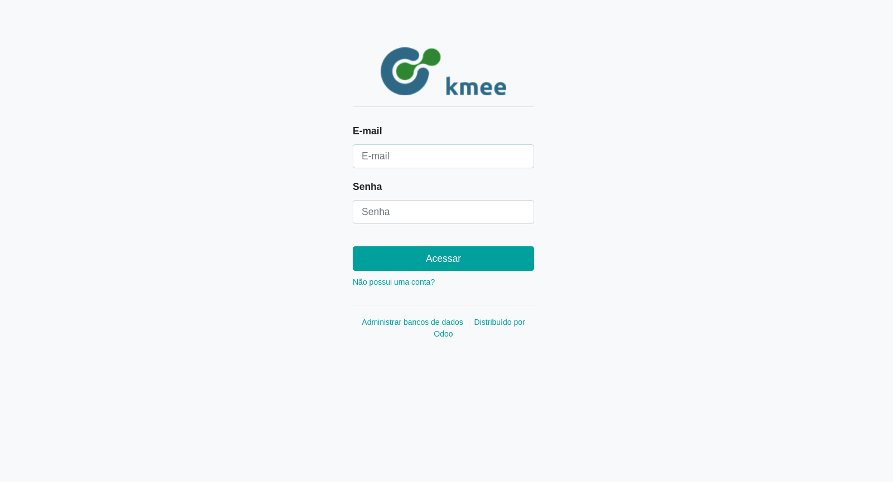
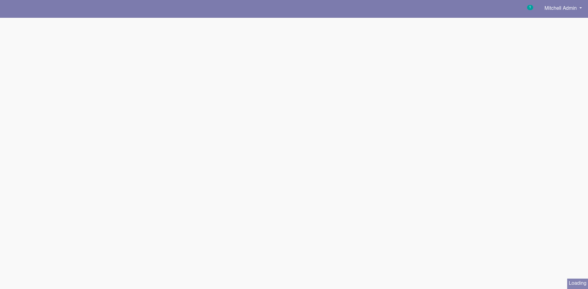
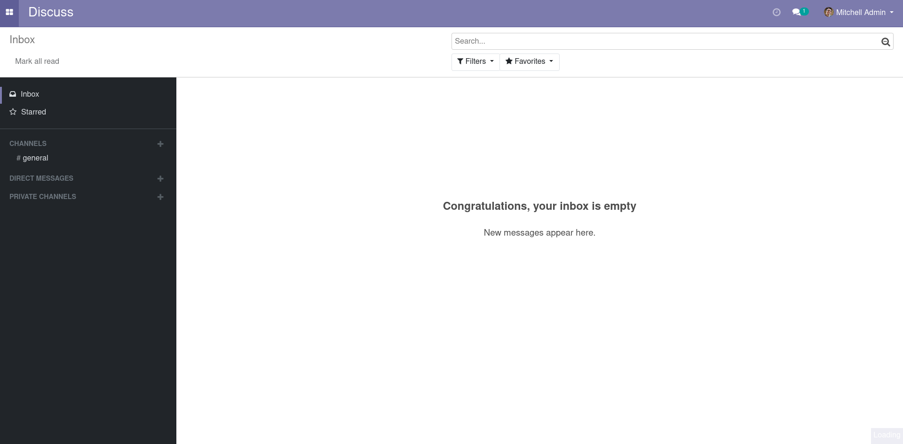

O Login no Odoo
===============

O login no Odoo, deve ser feito através de login, geralmente email e senha. Através da URL:

.. TODO: Colocar a URL do cliente aqui.

.. code::

   *** Settings ***

   Resource  ../odoo.robot

   *** Variables ***

   ${BROWSER}  firefox

   *** Test Cases ***

   Capture a screenshot of Odoo
       Open browser  ${ODOO_URL}/web/login  browser=${BROWSER}
       Capture page screenshot  login.png

   Valid Login
       Login
       Capture page screenshot  main.png

   Main Menu
        Wait Until Page Contains Element    //i[@class="fa fa-th-large"]
        Click Element    //i[@class="fa fa-th-large"]
        Capture page screenshot  main-menu.png

Após o login o usuário é redirecionado para a tela principal:

No canto superior direito é possível acessar todos os aplicativos:

