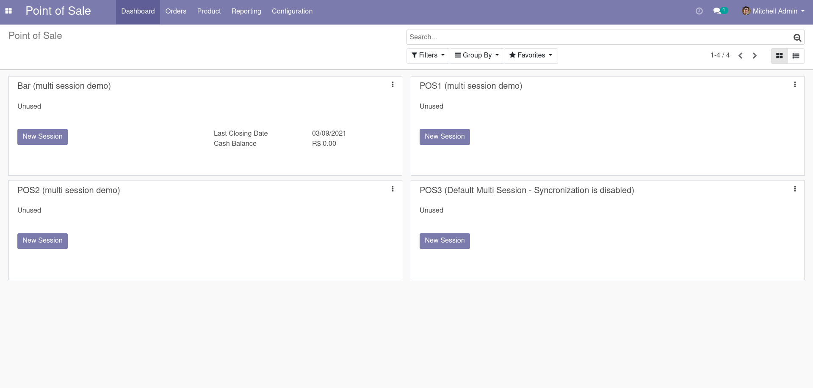
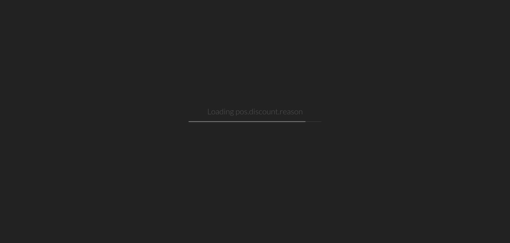
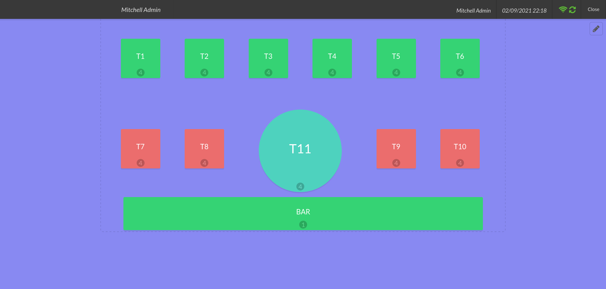
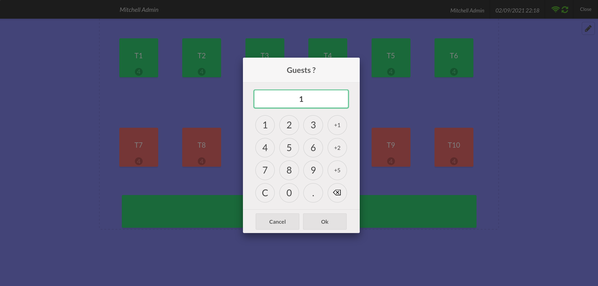

Ponto de Venda
==============

O Módulo do Ponto de venda pode ser dividido em três partes:

- Retaguarda: executada em núvem, acessada através do navegador no usuário. É nela que é gerenciado o ponto de venda, o cadastro de produtos, o estoque, as formas de pagamento aceitas e etc.
- Ponto de Venda: É executada localmente no navegador do usuário e fica disponível caso a internet não funcione (offline);
- IOT/POSBOX: Aplicação instalada em um ou mais computadores do estabelecimento e é responsável pelo acesso ao hardware: Impressoras, leitor de cartão, leitor de código de barras, balança, integração com SAT e etc.

Acesso ao POS
#############

O acesso ao ponto de venda pode ser feito através:

.. code:: robotframework
   :class: hidden

   *** Settings ***

   Resource  ../odoo.robot

   *** Variables ***

   ${BROWSER}  firefox

   *** Test Cases ***

   Com um login válido
       Login

   Acessar o POS
        Selecione o menu principal
        Selecione o aplicativo          Point of Sale
        Selecione o menu superior       Dashboard

   Tire um screenshot
      Capture page screenshot  pos.png

   Abra a sessão do Pos
        Ativar o Botão                  New Session
        Sleep    1s
        Capture page screenshot  pos-loading.png
        Sleep    1s
        Capture page screenshot  pos-loading-iot.png

    Abrindo uma mesa
        Sleep    3s
        Capture page screenshot  pos-loaded.png
        Selecione a mesa                T1
        Capture page screenshot  table-open.png

